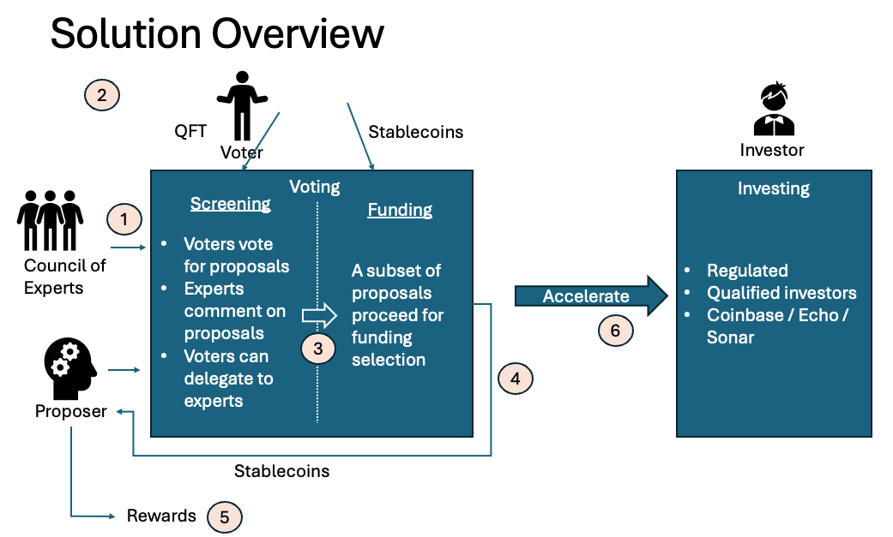

# **Decentralized Quantum Computing Funding — QC-DAO**

---

## **Vision**

A global, transparent DAO funding quantum computing research and start-ups — supporting innovation through collective intelligence.

---

## **Overview**

The Quantum Computing DAO (QC-DAO) proposes a decentralized, transparent, and expertise-driven funding ecosystem to accelerate global quantum innovation by providing research support from a community-governed, milestone-based model powered by blockchain. Through governance tokens (QFT), reputation-weighted voting, and stablecoin funding pools, the platform enables researchers, experts, contributors, and funders to collaboratively evaluate and advance high-quality quantum computing projects. Built on principles of open-source development, verifiable progress, and Sybil-resistant identity, QC-DAO integrates modern Web3 infrastructure to democratize access, reduce bias, and channel capital efficiently into start-ups, academic research, and foundational quantum technologies. This framework aims to foster rapid innovation, global participation, and long-term growth in the quantum computing ecosystem.

---

## **1. The Problem**

Quantum computing research is currently funded through a highly centralized model dominated by large government initiatives and corporate programs. Although billions of dollars flow into national programs like the €1 billion Quantum Technologies Flagship [^1] and over €11 billion from the EU and Member States in quantum technologies since 2021 and large investments in quantum computing proivders such as Quantinuum[^2] and QCi[^3], the funds rarely reach the long-tail of innovation—namely university researchers, small labs, and early-stage start-ups. These smaller players may hold the breakthrough ideas but lack efficient and accessible funding pathways to explore and develop their innovations.

At the same time, public interest in quantum computing is growing, yet individuals and smaller investors have no clear entry points to participate. Media narratives contribute confusion by alternating between exaggerated hype and skepticism, leaving potential contributors unsure how to engage. Without a mechanism to support bottom-up innovation and demonstrate near-term impact, the industry risks entering a “quantum funding winter,” which would significantly slow global progress.

---

## **2. The Solution — Decentralized Funding**

A decentralized funding model—built on blockchain and inspired by the DeSci[^4] movement—aims to democratize access to quantum research and accelerate innovation. By distributing decision-making and capital allocation across a global community, this model reduces bias, encourages transparency, and promotes a more diverse pipeline of ideas and contributors. Blockchain provides verifiable votes, auditable funding flows, and programmable incentives tied to measurable progress.

This approach also enables a broader set of participants to meaningfully contribute: researchers can propose projects, experts can evaluate them, and the public can support promising directions through governance tokens and funds. The result is a system where good ideas can emerge from anywhere, credibility is earned through contribution rather than influence, and funding can flow more efficiently toward impactful research and start-ups. Futhermore, the eco-system encourages education, collaboration and exposure for future investments.

---

## **3. Solution Overview**

The DAO ecosystem consists of proposers, experts, voters, and funders interacting through governance tokens and stablecoin pools. Proposers submit detailed quantum-related projects, which are pre-screened by experts before being opened to a wider voting community. Governance tokens (QFT) shape influence through reputation, delegation, and contribution history, while stablecoins form the actual funding mechanism for selected projects.

Through this layered structure, only the highest-quality and best-reviewed proposals advance to funding rounds. The system includes KPI tracking, milestone verification, and transparent reporting, ensuring accountability from proposers and confidence for funders. This creates a governance flow that blends decentralized decision-making with expert oversight, resulting in a reliable pipeline for quantum innovation.

---

## **4. Detailed System Design**

The platform defines five primary actors: proposers seeking funding, experts offering scientific review, voters shaping early-stage filtering, funders staking capital with a path for qualified investors to invest in regulated environments. Each group plays a distinct role in ensuring that projects are vetted, evaluated, and funded based on their merit and potential impact. Governance tokens align incentives by rewarding knowledgeable participation, while stablecoins ensure predictable financial operations.

Incentive structures are designed to promote long-term engagement. Members can earn rewards through reviewing milestones, contributing code or datasets, producing educational resources, or providing mentorship. This makes the ecosystem not just a funding mechanism but also a community-driven accelerator for quantum computing research and talent development. Platform fees will be taken when projects are funded.

### **Actors**

| Actor        | Role                                                             |
| ------------ | ---------------------------------------------------------------- |
| **Proposer** | Propose quantum projects, receiving funds if funded.             |
| **Expert**   | Comment and votes with governance tokens.                        |
| **Voter**    | Vote and/or delegate to experts with governance tokens.          |
| **Funder**   | Stake funds in a pool and vote on shortlisted projects.          |
| **Investor** | Qualified investors can invest in a regulated environment.       |

### **Tokens**

* **QFT** — governance token for expertise-weighted voting, reputation, and incentives.
* **Stablecoins** — funding pool for project grants.
* **Soul-Bound** — Soul-Bound tokens (SBT) for proposers and experts.

### **Incentives**

* Information on projects.
* Networking & community access
* Education (courses, AMAs)
* Access to experts, research, and start-ups
* Reputation-based rewards

---

## **5. Proposal Requirements**

To maintain rigorous quality and transparency, proposals must include essential information such as detailed descriptions, milestone structures, funding needs, and openness levels. Proposers must also provide verified identities through LinkedIn or ORCID and present their work in accessible formats like whitepapers, demo videos, and/or app links. These requirements ensure both accountability and clarity for voters evaluating the project. Each application to be expert or project proposal will need to be approved before appearing to voters.

Large Language Models will also be used to generate readable summaries for busy voters, improving the community’s ability to quickly understand and assess technical proposals. This helps streamline the review process and increases participation without sacrificing scientific depth or clarity.

Each proposal must include:

* Project name
* Description (whitepaper, video, links)
* Key personnel + LinkedIn / ORCID
* Minimum funding needed
* Milestones + tranche structure
* Openness / open-source level
* Reward model (IP, updates, etc.)

---

## **6. Expert Requirements**

Experts participating in the DAO can be from a quantum technology, business or investments background but must provide a clear and verifiable professional profile to ensure transparency, credibility, and trust in the evaluation process. Each expert is required to submit their full name, institutional affiliation, and a short bio that highlights their relevant expertise in quantum computing or related fields. To support identity verification, experts must also provide an ORCID ID or LinkedIn profile, ensuring that their background can be independently validated. Additionally, experts should briefly describe their motivation for joining the ecosystem—whether to contribute knowledge, support innovation, mentor emerging researchers, or help shape the direction of decentralized quantum funding. A profile photo is included to personalize the expert’s presence within the platform and strengthen community recognition.

In summary:
* Name, affiliation, short bio
* ORCID / LinkedIn
* Motivation for joining
* Photo for profile

---

## **7. Governance Principles**

Governance rules emphasize fairness, transparency, and scientific rigor. Expertise is prioritized over popularity by weighting votes according to reputation, evaluation history, and delegated authority. All governance decisions—from proposal progression to funding—are fully auditable on-chain, enabling independent verification and reducing bias. Milestone-based funding further ensures projects only receive additional support after delivering measurable progress.

The principles also promote open-source contributions, reinforcing the broader scientific mission of quantum research. The system remains adaptable, allowing modules such as investment functions or IP marketplaces to be added as the DAO matures.

* **Expertise over popularity** — weight votes by reputation/delegation.
* **Transparent & auditable** results.
* **Milestone-based funding** — only after verified progress.
* **Open-source bias** — prioritising open quantum algorithms & tools.
* **Adaptability** — modular expansion (e.g., investment platform later).

The DAO uses a combination of non-transferable credentials, reputation systems, and staking mechanisms to ensure integrity. Soul-Bound Tokens (SBTs) or verifiable credentials prevent identity manipulation by linking expertise to cryptographic badges. Quadratic voting reduces the impact of token-rich actors, while stake-to-vote systems ensure participants commit their tokens for a minimum duration.

Reputation decay and slashing mechanisms discourage spam, fraud, and low-quality participation. Meanwhile, lightweight KYC for experts and proposers reduces the risk of fabricated proposals or unqualified reviewers, all while maintaining pseudonymity for general voters.

---

## **8. QFT Token Incentive Model**

The QFT token incentive model rewards meaningful, high-quality contributions while discouraging manipulation and passive participation. Tokens are minted through Proof-of-Contribution activities such as reviewing milestones, contributing code or datasets, producing documentation, or providing workshops and mentorship. Voting on proposals also generates micro-rewards, scaled by a participant’s reputation, with anti-spam mechanisms like quadratic or logarithmic reward decay. Experts with strong, verified track records earn additional bonuses through delegated voting power and oracle-validated project outcomes. All QFT earned is subject to reputation-based vesting and may be clawed back in cases of fraud, inactivity, or low-quality participation, ensuring long-term alignment and integrity.

### **Proof-of-Contribution (PoC)**

QFT minted for:

* Reviewing/validating milestones
* Contributing code, datasets, results
* Writing documentation or educational content
* Hosting workshops / mentorship

### **Proposal Participation**

* Verified votes → micro-rewards scaled by reputation
* Anti-spam: decaying rewards (quadratic/log-weighted)

### **Delegation Incentives**

* Experts receive QFT bonuses
* Based on oracle-verified success metrics

### **Reputation-Based Vesting**

* QFT tokens are earned immediately but vest gradually over time to ensure long-term, trustworthy participation.
* Can be clawed back if fraudulent or inactive

### **Anti-Manipulation & Sybil Protection**

* **Soul-Bound Credentials** (non-transferable SBTs) for experts and proposers.
* **Quadratic voting / staking**
* **Stake-to-vote** + slashing for misconduct
* **Light KYC for proposers & experts**
* **Reputation decay** for inactivity

---

## **9. Regulatory Strategy**

To avoid classification as a security, QFT tokens have no profit expectation and cannot be traded on exchanges. Instead, QFT serves strictly as a governance and utility token within the DAO. Stablecoins act as the funding layer, keeping financial flows compliant and straightforward.

The system incorporates minimal but essential regulatory considerations, such as lightweight KYC for proposers and experts, AML and geopolitical awareness, and jurisdiction-sensitive practices. This ensures that the DAO can scale responsibly across different regions and avoid regulatory pitfalls while maintaining accessibility.

* Governance/utility tokens only — **no yield, no investment promise**
* Non-tradeable (no DEX listing)
* Clear tokenomics separation.

  * **QFT = governance**
  * **Stablecoin = funding**
  * **Investments on a seperate system** 

---

## **11. Technology Stack**

The technical stack integrates latest Web3 infrastructure with scalable off-chain systems. The front end relies on frameworks such as Next.js with wallet integrations via wagmi and RainbowKit; data stored using MongoDB with Prisma, while Hardhat and ethers.js provide development and testing in Sepolia. Identity can be managed using ZKpassport for privacy-preserving verification.

Monitoring and transparency are built into the system through oracle services, milestone verification tools, blockchain event logs, and analytical dashboards such as Dune, Tally API, or custom Voila/Streamlit apps. This ensures all stakeholders have real-time visibility into project progress and governance metrics such as voter participation, funds allocated and project progress.

---

## **12. Project Phases**

The project roadmap unfolds across three major phases. Phase 0 focuses on development, testing, and early community building. Phase 1 launches the ecosystem through marketing, governance token distribution, and the first grant round. It also introduces a public-facing presence via a website, social media, and a communication hub like Discord.

Phase 2 deepens engagement through connecting to regulated investment platforms, regional ambassador teams, hackathons, and cross-DAO collaborations. Finally, Phase 3 introduces the Quantum IP Sandbox, explores compliant IP tokenization models, and expands scientific outreach globally. These phases guide the DAO’s evolution from an MVP into a fully operational, globally recognized funding ecosystem.

### **Phase 0 — Build**

* Development, testing, community conversations

### **Phase 1 — Community Ignition**

* Promote QDAO
* Build ecosystem partners
* Gather feedback
* Open the first grant round
* Distribute governance tokens

**Deliverables:**

* MVP App + landing page
* X/Twitter account
* Public Discord/Telegram

### **Phase 2 — Growth**

* Dashboards
* Regional ambassadors
* Hackathons & bounties
* Begin Foundation formation
* Cross-DAO partnerships

### **Phase 3 — Expansion**

* Quantum IP Sandbox
* Legal & academic partnerships
* Explore tokenized IP models
* Expand global fellowships

---

## **14. Expectations**

The estimated setup cost is low for hosting and testnet infrastructure—while audits and future upgrades may require additional investment. The DAO is expected to operate leanly using platforms like Vercel for hosting and Sepolia for testing. Long-term success is measured by the volume of funded proposals, with an aspirational goal of at least one funded project per month.

Financial projections envision rapid growth in funding flows: $10M in Year 1, $100M in Year 2, and $1B in Year 3. These targets reflect the belief that decentralized funding can unlock massive global interest in quantum technologies once a trustworthy and transparent platform exists.

---

## **15. Timeline**

The timeline includes a development and testing phase concluding in December 2025, followed by a launch in January 2026. This schedule allows adequate time for contract testing, website deployment, initial community activation, and smart contract audits.

* **Dec 2025:** Design → Development → Testing
* **Jan 2026:** Public Launch

---

## **References**

[^1]: https://digital-strategy.ec.europa.eu/en/policies/quantum-technologies-flagship
[^2]: https://thequantuminsider.com/2025/11/05/fidelity-backs-10-billion-quantum-firm-quantinuum-in-oversubscribed-round/
[^3]: https://quantumcomputinginc.com/news/press-releases/quantum-computing-inc.-announces-500-million-oversubscribed-private-placement-of-common-stock-priced-at-the-market-under-nasdaq-rules
[^4]: https://www.desci.com/
